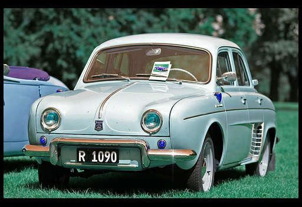
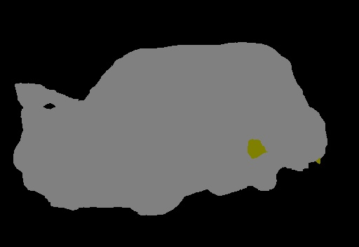

# 简介
本代码为系列课程, 第九周部分的课后作业内容。
http://edu.csdn.net/lecturer/1427

# TinymMind上GPU运行费用较贵，每 CPU 每小时 $0.09，每 GPU 每小时 $0.99，所有作业内容推荐先在本地运行出一定的结果，保证运行正确之后，再上传到TinyMind上运行。初始运行推荐使用CPU运行资源，待所有代码确保没有问题之后，再启动GPU运行。

TinyMind上Tensorflow已经有1.4的版本，能比1.3的版本快一点，推荐使用。

## 作业内容

本作业以week9视频中讲述的FCN为基础，构建一个FCN训练模型，要求学员实现代码中缺失的部分并使用自己的实现跑出比较好的结果。


### 数据集
本作业使用Pascal2 VOC2012的数据中，语义分割部分的数据作为作业的数据集。

VOC网址：http://host.robots.ox.ac.uk/pascal/VOC/voc2012/

本次作业不提供数据集下载，请学员自行到上述网址找到并下载数据，同时请仔细阅读VOC网站对于数据集的描述。

VOC数据集目录结构如下：
```
├── local
│   ├── VOC2006
│   └── VOC2007
├── results
│   ├── VOC2006
│   │   └── Main
│   └── VOC2007
│       ├── Layout
│       ├── Main
│       └── Segmentation
├── VOC2007
│   ├── Annotations
│   ├── ImageSets
│   │   ├── Layout
│   │   ├── Main
│   │   └── Segmentation
│   ├── JPEGImages
│   ├── SegmentationClass
│   └── SegmentationObject
├── VOC2012
│   ├── Annotations
│   ├── ImageSets
│   │   ├── Action
│   │   ├── Layout
│   │   ├── Main
│   │   └── Segmentation
│   ├── JPEGImages
│   ├── SegmentationClass
│   └── SegmentationObject
└── VOCcode
```

其中本次作业使用VOC2012目录下的内容。作业数据集划分位于**VOC2012/ImageSets/Segmentation**中，分为train.txt 1464张图片和val.txt1449张图片。

语义分割标签位于**VOC2012/SegmentationClass**,注意不是数据集中所有的图片都有语义分类的标签。
语义分割标签用颜色来标志不同的物体，该数据集中共有20种不同的物体分类，以1～20的数字编号，加上编号为0的背景分类，该数据集中共有21种分类。编号与颜色的对应关系如下：
```py
# class
classes = ['background', 'aeroplane', 'bicycle', 'bird', 'boat',
           'bottle', 'bus', 'car', 'cat', 'chair', 'cow', 'diningtable',
           'dog', 'horse', 'motorbike', 'person', 'potted plant',
           'sheep', 'sofa', 'train', 'tv/monitor']

# RGB color for each class
colormap = [[0, 0, 0], [128, 0, 0], [0, 128, 0], [128, 128, 0], [0, 0, 128],
            [128, 0, 128], [0, 128, 128], [128, 128, 128], [64, 0, 0], [192, 0, 0],
            [64, 128, 0], [192, 128, 0], [64, 0, 128], [192, 0, 128],
            [64, 128, 128], [192, 128, 128], [0, 64, 0], [128, 64, 0],
            [0, 192, 0], [128, 192, 0], [0, 64, 128]]
```

对应关系可由**VOCcode/VOClabelcolormap.m**计算得出，作业代码中也有计算对应关系的代码，这里不再详述，请学员自行理解代码。

>需要注意，分类中其实还有一个编号为255的分类，其颜色对应[224, 224, 192],这个分类用作边界着色，这里不处理这个分类。

### 训练数据准备
训练数据需要预先打包成tfrecord格式，本步骤在本地完成。

打包使用作业代码中的**convert_fcn_dataset.py**脚本进行。脚本内容已经删掉一部分，需要由学员自行补全缺失部分的代码。

```
python3 convert_fcn_dataset.py --data_dir=/path/to/VOCdevkit/VOC2012/ --output_dir=./
```


本步骤最终生成的两个文件**fcn_train.record**,**fcn_val.record**分别在400MB左右，共800MB左右，如果最后的文件大小过大或过小，生成数据的过程可能有问题，请注意检查。

>提示：可以参考week8中数据集生成部分的代码来补全这里的代码。

### 数据集上传
请参考week7,week8中的内容，这里不再详述。

### 预训练模型
预训练模型使用tensorflow，modelzoo中的VGG16模型，请学员自行到modelzoo中查找并将该预训练模型放到tinymind上。

网络有问题的学员，可以使用已经预先上传到tinymind的模型，数据集为**ai100/vgg16**.

### 模型
模型代码以课程视频week9 FCN部分的代码进行了修改，主要是代码整理，添加了数据输入和结果输出的部分。

代码参考：https://gitee.com/ai100/quiz-w9-code.git

在tinymind上新建一个模型，模型设置参考如下模型：

https://www.tinymind.com/ai100/quiz-w9-fcn

复制模型后可以看到模型的全部参数。

需要注意的是，代码中使用了额外的库，所以在建立模型的时候，需要在依赖项中，填入以下项目：
```
pydensecrf
opencv-python
```
>cv2即是opencv-python,本地运行的话，使用pip安装即可。这个不是一个官方版本，缺一些比较少用的功能，本作业用这个版本就足够了。官方版本需要编译，而且过程比较复杂，没有特殊必要，不要编译安装。

模型参数的解释：

- checkpoint_path VGG16的预训练模型的目录，这个请根据自己建立的数据集的目录进行设置。
- output_dir 输出目录，这里使用tinymind上的/output目录即可。
- dataset_train train数据集的目录，这个请根据自己建立的数据集的目录进行设置。
- dataset_val val数据集的目录，这个请根据自己建立的数据集的目录进行设置。
- batch_size BATCH_SIZE，这里使用的是16,建立8X的FCN的时候，可能会OutOfMem，将batch_size调低即可解决。
- max_steps MAX_STEPS， 这里运行1500步，如果batch_size调整了的话，可以考虑调整一下这里。
- learning_rate 学习率，这里固定为1e-4, 不推荐做调整。

运行过程中，模型每100个step会在/output/train下生成一个checkpoint，每200步会在/output/eval下生成四张验证图片。

>FC论文参考 https://arxiv.org/abs/1411.4038
### 作业内容
- 学员需要将convert_fcn_dataset.py中的代码补全并生成对应的数据集文件上传到tinymind。
- 学员需要在作业提供的代码基础上添加8X的FCN实现并进行训练。


> tinymind上有已经上传好的[数据集](https://www.tinymind.com/ai100/datasets/quiz-w9)，仅供测试和参考，作业中请自己处理数据集并上传，使用这个数据集的作业数据集部分不给分。

### 结果评估

#### 数据集准备完成-20分：
- 数据集中应包含train和val两个tfrecord文件，大小在400MB左右

#### 模型训练完成-20分：
在tinymind运行log的输出中，可以看到如下内容：
```sh
2018-01-04 11:11:20,088 - DEBUG - train.py:298 - step 1200 Current Loss: 101.153938293
2018-01-04 11:11:20,088 - DEBUG - train.py:300 - [23.54] imgs/s
2018-01-04 11:11:21,011 - DEBUG - train.py:307 - Model saved in file: ./out/train/model.ckpt-1200
2018-01-04 11:11:21,018 - DEBUG - train.py:314 - validation generated at step [1200]
2018-01-04 11:11:28,461 - DEBUG - train.py:298 - step 1210 Current Loss: 116.911231995
2018-01-04 11:11:28,461 - DEBUG - train.py:300 - [19.11] imgs/s
2018-01-04 11:11:35,356 - DEBUG - train.py:298 - step 1220 Current Loss: 90.7060165405
```
#### 训练结果完成-20分：
训练完成之后，可以在**/output/eval**下面生成验证的图片，其中**val_xx_prediction.jpg**的图片为模型输出的预测结果，内容应可以对应相应的annotation和img。根据验证图片的内容，结果可能会有区别，但是肯定可以看到输出的结果是明显有意义的。

#### 模型代码补全 -20分：
train.py中可以看到8x代码的实现。形式可能会有区别，但是有比较明显的三个上采样过程，两个2X，一个8X，及其结果的融合。

最后的效果如下：
原图



标签


预测



CRF之后的预测


#### 心得体会-20分：
提供一份文档，描述自己的8Xfcn实现，需要有对关键代码的解释。描述自己对fcn的理解。
### 参考内容

本地运行训练使用的命令行：
```sh
python train.py --checkpoint_path ./vgg_16.ckpt --output_dir ./output --dataset_train ./fcn_train.record --dataset_val ./fcn_val.record --batch_size 16 --max_steps 2000
```
